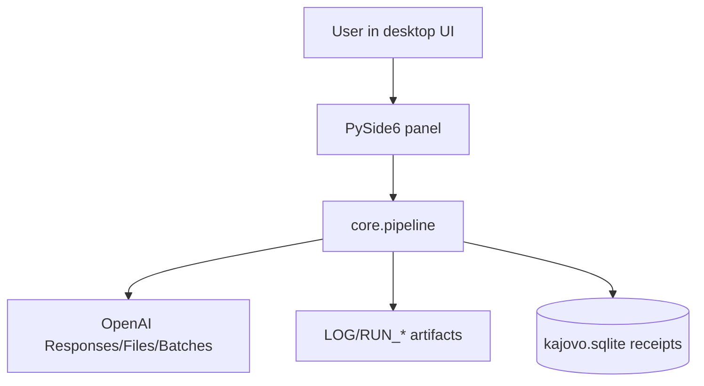

# KájovoHotel Architecture

## Module overview
- `kajovo/app`: desktop entrypoint and app bootstrap.
- `kajovo/ui`: PySide6 UI panels (files, batch, pricing, vector stores).
- `kajovo/core`: orchestration pipeline, API client, logging, config, diagnostics.

## Main flow

## Diagrams
- [System context](diagrams/system-context.mmd)
- [Main flow](diagrams/main-flow.mmd)
- [Key sequence](diagrams/key-sequence.mmd)
- [Components](diagrams/components.mmd)
