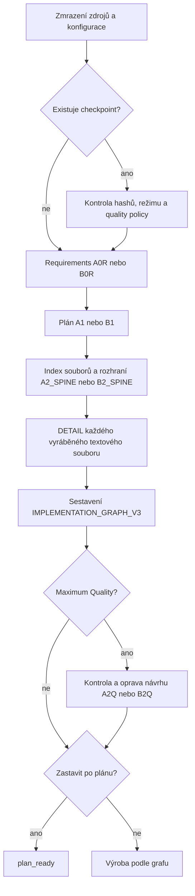
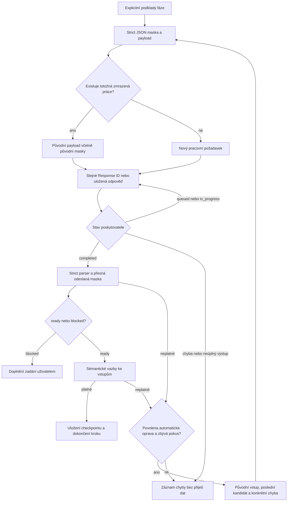
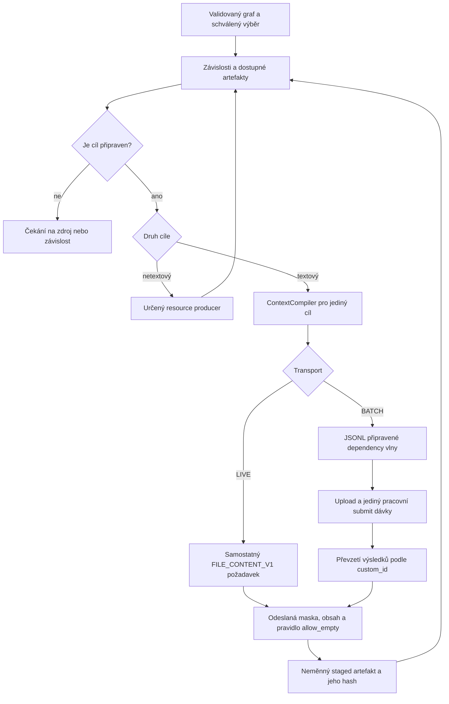

# Procesní vazby

Kanonické kontrakty určuje [SSOT](SSOT.md). Tento dokument popisuje přípravu a souborovou výrobu GENERATE/MODIFY; není potvrzením úplného auditu ostatních procesů aplikace.

## Společná příprava GENERATE a MODIFY

Již přijaté položky checkpointu se znovu negenerují. MODIFY navíc předává neměnné originály, inventář a povinnosti zachování chování. DETAIL se obnovuje po jednotlivých souborech. Příprava je LIVE i tehdy, když následná souborová výroba používá BATCH.

## Jeden přípravný požadavek

Stejný kandidát se stejnou validační chybou ukončuje opravy jako `NO_PROGRESS`. Neznámý výsledek odeslání není povolením pro nový POST. Obnova přípravy může převzít starou masku jen při shodě ostatního obsahu požadavku; nezaměňuje tím změněné zadání za původní práci.

## Souborová výroba

Kontraktní závislosti poskytují popis rozhraní; samy nevyžadují pořadí výroby. Obsahové závislosti vyžadují konkrétní dostupný artefakt se shodným kontraktem a hashem. BATCH řádky mají samostatný explicitní kontext bez `previous_response_id` a bez `background`. Stažení a kontrola integrity nejsou testem funkčnosti produktu.
