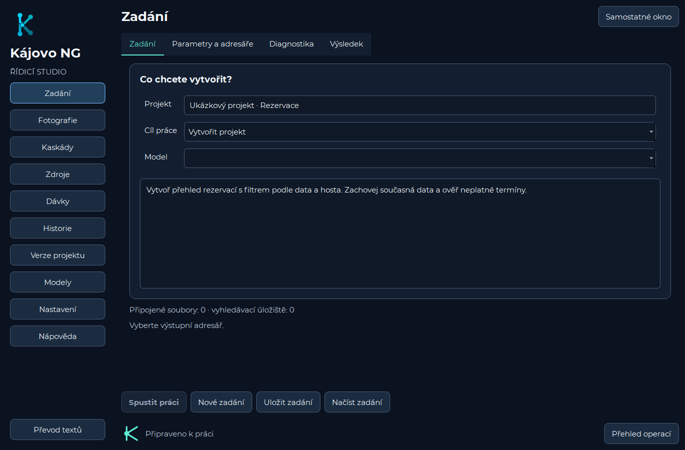

# Řídicí studio Kájovo NG

Produkční sestavu vytváří `kajovo.studio.application.create_window`; stejnou továrnu používají testy a snímkovací nástroj. Rozhraní neimportuje `kajovo.desktop`. Starší implementace zůstává pro regresní porovnání, není záložní cestou spouštěče. Samostatný převodník používá Qt a společné komponenty.

## Vizuální pravidla

Tmavá plocha `#0B1220`, karty `#131F30`, zvýrazněné plochy `#1B2C41`, text `#F3F7FC`, vedlejší text `#B8C7D9`, akcent `#5EEAD4`, fokus `#7DBBFF`, úspěch `#79E2B0`, upozornění `#FFD080`, chyba `#FF9DAB`. Písmo Montserrat 11 bodů. Pole, výběr cesty, karty, posuvné formuláře, detail a průběh pocházejí ze společných komponent. Barva doprovází textový stav.

Logo `resources/studio-symbol.png` doprovází větvený symbol kreslený Qt. Animace značí místní aktivní operaci, nikoli potvrzenou aktivitu serveru. Volba Omezit animace se ukládá v Nastavení. Pod šířkou 1000 logických bodů se navigace otevírá tlačítkem Sekce. Minimum hlavního okna je 640 × 360. Dlouhé formuláře a skupiny tlačítek mají posuv; spuštění Zadání zůstává mimo posuvný obsah. Sekci lze oddělit do okna a zavřením vrátit se stejnými hodnotami.

## Funkční mapa

| Sekce | Implementace v `kajovo/studio` | Backend |
|---|---|---|
| Zadání | `workbench.py` | `RunWorker`, `UiRunConfig`, `validate_run_options`, `RunLogger` |
| Fotografie | `photos.py` | `photo_templates`, `photo_prompt`, `photo_batch`; skutečné dávky a převzetí |
| Kaskády | `cascades.py`, `cascade_items.py` | `CascadeDefinition`, `validate_cascade_definition`, `CascadeRunWorker` |
| Zdroje | `resources.py` | Files a Vector Stores `OpenAIClient`, přílohy běhu |
| Dávky | `batches.py` | `list_batches`, `complete_saved_batch`, `repeat_saved_batch`, `cancel_batch` |
| Historie | `history.py`, `evidence.py` | `HistoryIndex`, `LegacyRunAdapter`, checkpoint, SHA-256, lineage |
| Verze | `versions.py` | `core/project_git.py`, Git a editor s kontrolou souběžných změn |
| Modely | `application.py` | Účtový katalog, pevná matice, uložený výchozí model |
| Nastavení | `settings.py` | `save_settings`, `persist_api_key`, SMTP |
| Převod textů | `converter.py` | `utf8nobom.app`, zálohy a převod souborů i archivů |

## Průběh a souběh

Správce operací vlastní pracovní vlákno až do signálu `finished`. Skrytí dialogu operaci nezastavuje. Zastavit je dostupné jen s bezpečným ukončením backendu. Průběh uvádí etapu, doložené jednotky, stáří zprávy, uplynulý čas a dostupný odhad. Neznámý postup je neurčitý.

Dokončeno, částečný výsledek, zastavení, předání dávky, čekání na odpověď, neznámý výsledek odeslání a návrh bez zápisu jsou odlišné. Přehled operací otevírá vybraný průběh. Pravidelné sledování dávek používá jeden dialog. Překrývající se zapisující adresáře jsou rezervované do skutečného konce pracovníka.

## Validace

[Původní matice](UI_VALIDATION_MATRIX.csv) zachycuje datové parametry. [Validační plán studia](ui/validation-plan.csv) doplňuje nové kontrakty, zdroje a testy. Modely a kombinace zůstávají v [matici požadavků](REQUEST_MATRIX.md). Nedostupná uložená hodnota není tiše nahrazena. Maximální propracovanost přidává nezávislou kontrolu návrhu pro vytváření a úpravu projektu a může zvýšit cenu i dobu práce.

`core/user_errors.py` klasifikuje konkrétní kód a řetězec příčin. Samotné HTTP 429 nerozlišuje kredit a rychlost; timeout nepotvrzuje přijetí požadavku. Neznámá příčina zůstává výslovně neznámá. Technické podrobnosti jsou dostupné. Stoprocentní určení kořenové příčiny bez důkazů není součástí kontraktu.

[Procházet galerii všech výsledných snímků](ui/gallery.html).

## Reprodukce

[Výchozí snímky](ui/before/manifest.json), [statický inventář studia](ui/studio-inventory.json) a manifesty výsledných snímků obsahují konstrukce, vlastnosti, vazby a skutečné instance s popisky, souřadnicemi a dostupností. Statická vazba sama nedokazuje úspěšnost vzdálené operace.

```powershell
.venv\Scripts\python.exe scripts/audit_studio.py
.venv\Scripts\python.exe scripts/render_studio.py --native --size 1366,900 --output docs/ui/after/1366x900
.venv\Scripts\python.exe scripts/render_studio.py --native --size 640,360 --output docs/ui/after/640x360
.venv\Scripts\python.exe scripts/render_studio.py --native --size 911,480 --scale 1.5 --output docs/ui/after/911x480-150
```

Snímkování používá dočasné ukázkové podklady, blokuje síť a čtení skutečných klíčů. Zelený testovací obrázek slouží geometrii galerie. Automatické funkční testy nahrazují vzdálené služby a pracují se skutečnými dočasnými soubory. Snímky neprokazují úspěšnost placené operace u poskytovatele.


