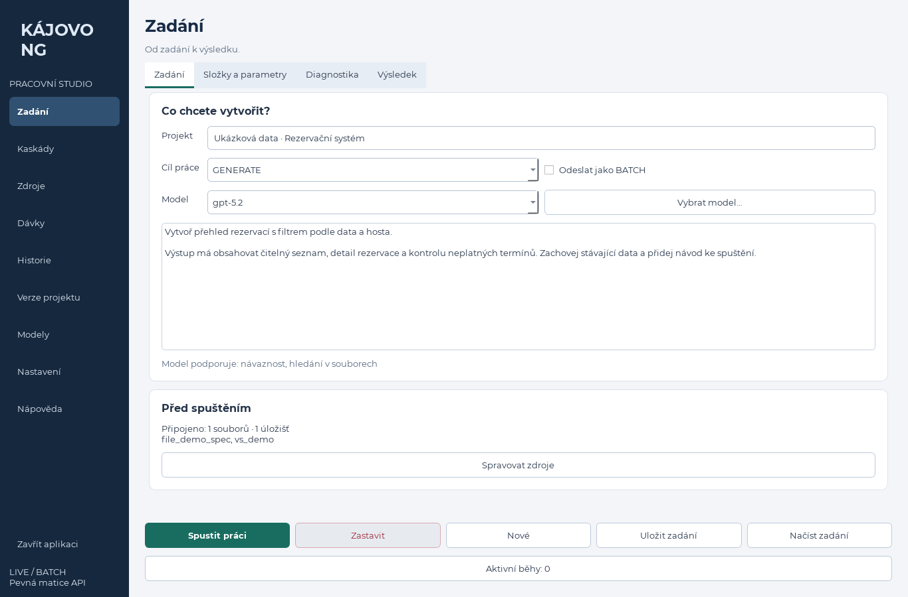
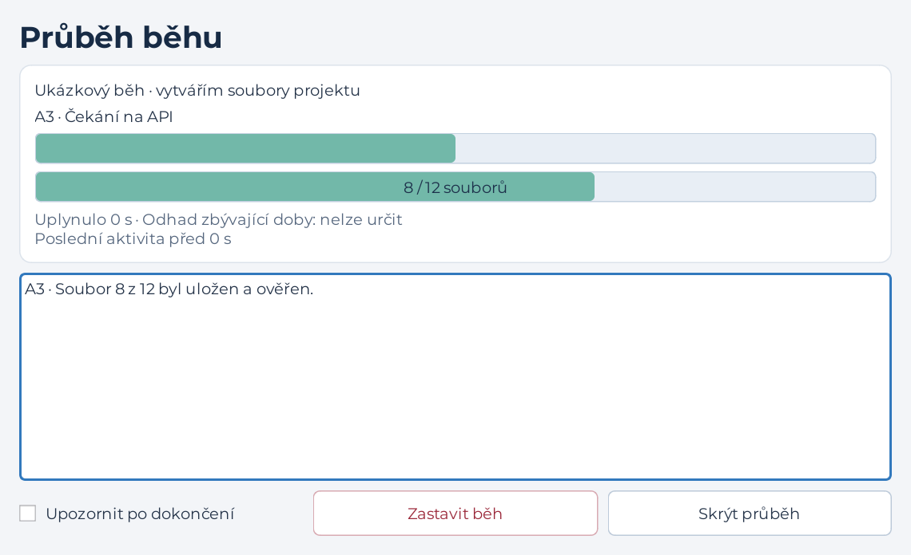

# Návrh a smlouva desktopového rozhraní

## Inventura rozhraní

[Úplný inventář](UI_INVENTORY.json) zachycuje AST aktuálních modulů `kajovo/desktop`: třídy, metody, konstrukce ovládacích prvků a propojení signálů s odkazy do zdrojových souborů. Zahrnuje i pomocné konstrukce; nejde o počet současně viditelných polí.

## Informační architektura

| Sekce | Obsah a akce |
|---|---|
| Zadání | Projekt, GENERATE/MODIFY/QA/QFILE/KASKADA, LIVE/BATCH, model, prompt a výsledek, připojené zdroje, IN/OUT, návaznost response_id, teplota, modely A1/A2/A3, snapshot, diagnostika Windows/SSH, Nový/Uložit/Načíst/Spustit/Zastavit/ReRun |
| Kaskády | Knihovna definic, vytvoření/uložení/uložení pod jiným názvem/načtení, přidání/duplikace/odstranění/přesun kroků, model, teplota, instrukce, text/JSON vstup, soubory API i lokální, proměnné předchozích kroků, návaznost, text/JSON výstup, manifest/prompts/vlastní schéma, očekávané cesty a OUT |
| Zdroje | Soubory API: obnovit, nahrát, smazat vybrané/vše, připojit/odpojit; úložiště: vytvořit/smazat vybrané/vše, seznam souborů, přidání podle ID/z API, odebrání, podrobnosti a atributy JSON, připojit/odpojit |
| Dávky | Projekt, místní datum odeslání, oddělený stav API a uložení do OUT, Dokončit, seznam/počty/poslední a příští kontrola, interval a konec sledování, stažení raw i souborového výstupu, částečné chyby, zrušení, opakování vybraných cest a oprava s připomínkou |
| Historie | Běhy, request/response, filtry běh/odpověď/datum/fulltext, detail, TXT/tisk, Dokončit u nepřevzatých BATCH, pokračování ReRun ostatních běhů; provozní log |
| Verze | Lokální adresář a Git, založení, stav, remote/push/pull, milníky vytvořit/obnovit/odstranit, odstranění repozitáře, strom, editor, porovnání s milníkem |
| Nastavení | Klíč zobrazit/uložit/smazat, výchozí model a teplota, bezpečnost vstupů, deny přípony/globy, timeouty API/BATCH, SMTP host/port/login/heslo/TLS/SSL/odesílatel/příjemce/uložit/test, SSH |
| Modely a nápověda | Katalog účtu, hledání a filtry schopností, výchozí a aktivní model, pevná matice, návody a vysvětlení režimů |

## Validační matice

API pravidla zůstávají centrálně v `core/request_rules.py`, `core/model_registry.py` a `core/response_policy.py`. UI zobrazuje důvod zákazu a předává stejný snímek nastavení do backendu. Změna dostupnosti nesmí tiše vybrat jiný model.

| Volba / situace | Pravidlo a reakce |
|---|---|
| Model | Přesný identifikátor pevné matice a dostupnost v katalogu účtu; neznámý zůstává viditelný jako nedostupný |
| Režim × model × přílohy | [Matice modelů](MODEL_MATRIX.md), [matice požadavků](REQUEST_MATRIX.md), [1024 kombinací](REQUEST_COMBINATIONS.csv) |
| BATCH | Jen GENERATE/MODIFY; GENERATE A1/A2 běží LIVE, A3 BATCH; návaznost/diagnostika podle konkrétní fáze |
| Teplota | 0–2 pouze v podporovaném režimu modelu; jinak neposílat |
| response_id | Podpora návaznosti modelu; nepovolit nezávislým dávkovým položkám |
| Files / vector stores | Validní ID, typ a velikost souborů, schopnosti modelu, pravidla file_search a BATCH; serverový preflight před pracovním požadavkem |
| MODIFY | Existující IN; zapisující režimy vyžadují OUT; souběžné zapisující běhy nesmějí mít překrývající se OUT |
| IN = OUT | OUT sleduje IN; snapshot a bezpečné cesty platí i při přepisu |
| Diagnostika | Dostupnost podle režimu; SSH vyžaduje spojení a případný pin; spuštění oprav vždy s existujícím potvrzením obsahu/cíle/hash |
| Kaskáda | Neprázdné kroky, přesné modely, JSON objekt/seznam vstupu, validní schéma, JSON výstup při schématu, bezpečné relativní očekávané cesty, proměnné pouze známých kroků |
| Síť / průběh | Operace ve workeru, neznámá doba jako neurčitý průběh; procenta jen z doložených jednotek; zavření nesmí zahodit běžící worker |
| Nastavení | Rozsahy podle `core/config.py`; SMTP TLS a SSL se vylučují; hesla nepatří do uloženého JSON |
| Git a zápis | Bezpečné cesty, ochrana vyloučených adresářů/tajemství, potvrzení destruktivních operací |

Podrobné řádky všech datových parametrů a rozsahů nových ovladačů jsou v [UI validační matici](UI_VALIDATION_MATRIX.csv). Sloupec druhu rozlišuje datový kontrakt a omezení ovladače; interní nastavení nemají vlastní přepínač. API kombinace se záměrně odkazují na jednu centrální matici, aby se pravidla nerozcházela.

## Vizuální návrh

Klidná světlá pracovní plocha s trvalou tmavou navigací. Jedna hlavní akce na obrazovce, běžné a pokročilé parametry oddělené. Konzistentní pole, jednotně zarovnané popisky, české názvy a viditelné jednotky. Tabulky mají čitelné hlavičky, výběr řádku a vodorovné posouvání. Obsah se posouvá svisle, hlavní navigace a přístup k aktivním běhům zůstávají dosažitelné.

## Oponentura z pohledu uživatele a zapracované požadavky

1. „Nevím, co nastavit jako první.“ Zadání začíná projektem, cílem, modelem a promptem. Pokročilé parametry jsou označené a neblokují čtení zadání.
3. „Nevím, co posílám.“ Připojené soubory a úložiště mají souhrn přímo u zadání a odkaz na správu zdrojů.
4. „Zavřel jsem průběh a nevím, zda běží.“ Aktivní běhy mají trvalý seznam a tlačítko znovu otevřít. Skrytí neznamená zastavení.
5. „V malém okně se nevejdou tlačítka.“ Hlavní akce zůstávají dostupné; formuláře mají posuv a žádné rozložení se po sestavení nepřestavuje přemísťováním starých prvků.
6. „Změna modelu mi přepíše volbu.“ Nedostupný uložený model se označí a zablokuje spuštění; náhradu volí uživatel.
7. „Dávka je hotová, ale nemám soubory.“ Stav API, stažení a ověření souborů jsou odlišné stavy s vlastním souhrnem chyb.
8. „Omylem jsem něco smazal.“ Mazání na serveru, odstranění Git, obnova milníku a spuštění oprav zachovávají potvrzovací dialogy.

## Dialogový kontrakt

Nové dialogy zachovají titul, účel, všechny informační položky, potvrzení/zrušení a technické podrobnosti zaznamenané v inventáři. Průběh běhu obsahuje stav/fázi, čas, ETA nebo její nedostupnost, stáří poslední aktivity, dvě úrovně průběhu, log, Stop, upozornění po dokončení a Skrytí. Hromadná operace obsahuje stav, počty, log a dostupné zavření až po dokončení. Upload obsahuje aktuální soubor, počet/průběh, log a kooperativní zrušení; ESC/X neruší životnost workeru.

## Ověření implementace

Funkční inventář se porovná s novými akcemi a testy. Skript `scripts/render_ui.py` pořizuje snímky hlavních sekcí a druhů dialogů ze skutečně vykresleného Qt rozhraní, v běžném i menším okně. Kontrola zahrnuje ořez, kontrast, jednotky, tab pořadí, prázdné/chybové stavy a dostupnost hlavních akcí. Backendové testy, desktopové testy, Ruff a konzistence závislostí jsou povinné před zápisem na main.

## Implementační mapa

| Oblast inventáře | Nový modul |
|---|---|
| Hlavní okno, navigace, běhy, ReRun, modely | `desktop/application.py`, `desktop/recovery.py` |
| Soubory a vector stores | `desktop/resources.py` |
| Kaskády | `desktop/cascades.py` |
| Dávky a bezpečný import | `desktop/batches.py` |
| Request/response historie | `desktop/history.py` |
| Git a editor | `desktop/versions.py` |
| API klíč, provoz, bezpečnost, SMTP | `desktop/settings.py` |
| Průběhy, potvrzení, souborové a textové dialogy | `desktop/dialogs.py` |
| Samostatná okna, výběr modelu, splash | `desktop/windows.py` |
| Vizuální prvky a asynchronní úlohy | `desktop/design.py`, `desktop/jobs.py` |

Původní moduly nejsou importovány ani zachovány jako záložní cesta. Backendové kontrakty API, souborů a běhů zůstávají společné. Snímkovací skript pokrývá také aktivní, dokončený, zastavený a chybový průběh, detail, samostatné sekce a výběr souboru. Vizuální kontrola se zaměřuje na dostupnost patiček při 150% škálování; navigace a dlouhé formuláře používají posuv. Nativní systémové dialogy vyžadují ověření na Windows.

## Snímky rozhraní

Skutečně vykreslené Qt rozhraní s izolovanými ukázkovými daty. Zadání je z plochy 1366 × 900; dialogy z logické plochy 911 × 480 při 150% škálování.

