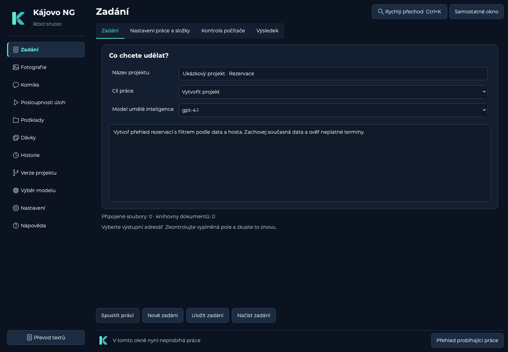

# Obrazové návrhy KájovoNG

Návrhy vznikly vestavěným nástrojem ImageGen. Produkční logo je rastrový PNG prostředek [studio-symbol.png](../../resources/studio-symbol.png). Obrázkové návrhy určují vzhled; dostupnost ovladačů, skutečné počty a význam stavů určuje běžící aplikace a SSOT.

- [Návrh Studia](navrh-studio.png)
- [Návrh průběhu](navrh-prubeh.png)
- [Návrh rychlého přechodu](navrh-rychly-prechod.png)

## Skutečná implementace

Snímky vznikají z produkčních Qt widgetů nad izolovanými ukázkovými daty a se zakázanou sítí. Význam stavů a počtů se zachovává; návrhový obrázek se nepoužívá jako důkaz vykonání operace.

- [Studio](studio.png)
- [Průběh práce](prubeh.png)
- [Rychlý přechod](rychly-prechod.png)

## Použité zadání loga

Vytvoř jeden zcela nový finální RASTROVÝ obrázek loga pro KájovoNG, 1024x1024. Luxusně jednoduchý, klidný, nadčasový symbol písmene K pro profesionální desktopové řídicí studio. Ploché čisté barvy, nejvyšší grafická čistota a naprosto hladké ostré antialiasované hrany. Pozadí celého čtverce je dokonale jednolitá tmavomodrá #0B1220. Uprostřed s pravidelným 18procentním okrajem je výrazné geometrické K. Krátký masivní svislý dřík v jemné mátové #5EEAD4 a dvě elegantní diagonální masivní větve v tlumené tyrkysové #35B8B2, spojení přesně vyřešené drobnou čistou tmavomodrou negativní mezerou. Švýcarsky vyvážené proporce, mírně zaoblené vnější konce a rohy, jasná jednoduchá silueta i při 24px. Čistě ploché tvary bez jakýchkoli kruhových uzlů či mikrodetailů. Každá část používá jedinou plnou barvu. ŽÁDNÉ přechody, textury, skvrny, šum, drobné tečky, hrubé hrany, stíny, 3D, světlo, neon, odlesky, obrysy, nápisy, dekorace, rámeček, vodotisk ani další obrázky. Je to hotový kvalitní bitmapový znak loga na tmavé ploše, nikoli screenshot, papírový mockup nebo SVG.

## Použité zadání: Studio

Vytvoř realistický obrazový demorender návrhu úprav existující desktopové aplikace KájovoNG v poměru 3:2. První reference je skutečný screenshot a určuje povinné funkce a rozložení; druhá reference je finální rastrové logo, přesně je použij. Profesionální evoluce stávající tmavé aplikace, precizní Montserrat, matná tmavomodrá #0B1220, karty #131F30, jemné okraje a tyrkysový akcent #5EEAD4. Zachovej všechny sekce vlevo (Zadání, Fotografie, Komiks, Posloupnosti úloh, Podklady, Dávky, Historie, Verze projektu, Výběr modelu, Nastavení, Nápověda, Převod textů), celý formulář Zadání, čtyři jeho záložky a spodní pracovní akce. Sidebar nově má kompaktní kvalitní logo, klidné ploché položky a jasný tyrkysový proužek aktivní sekce, horní část odděl decentní linkou. Horní hlavička Zadání vpravo obsahuje nové tlačítko 'Rychlý přechod' s drobným 'Ctrl+K' a stávající 'Samostatné okno'. Footer má malý shodný rastrový znak a text stavu místní práce. Pole název projektu, cíl práce, model a velké zadání zachovej. Žádné nové dashboardové grafy, vymyšlené procento, marketingové informace, svítící efekty nebo změny procesního významu. Má to být přesvědčivý implementovatelný screenshot hotového kvalitního Qt studia, české texty, bez vnějšího notebooku či perspektivy.

## Použité zadání: průběh

Vytvoř realistický obrazový demorender profesionálního redesignu popupu Průběh práce pro desktopové KájovoNG, poměr 4:3. První reference je skutečný Qt popup a určuje zachovávaný význam; druhá je finální rastrové logo. Sjednoť popup do stejné matné tmavomodré #0B1220, povrchy #131F30, jemné okraje a tyrkysová #5EEAD4 místo levandulové. Montserrat, české texty, čisté rozestupy, žádný neon ani velký glow. Nahoře malé nové rastrové logo s textem KÁJOVO NG / PRŮBĚH PRÁCE a titulek 'Připravuji soubory projektu'. Vlevo zachovej kruhovou mapu přesně čtyř ohlášených kroků, uprostřed velký údaj '01 / 04' a 'potvrzených kroků'. Na aktuálním bodu kruhu drobné soustředné pulzní halo jako snímek jemného dvojitého heartbeatu, ostatní body klidné. Vpravo karta 'PRÁVĚ SE DĚJE', 'Ověřování souborů', 'Práce probíhá', srozumitelná věta, doba práce a stáří poslední zprávy, další známý krok. Pod kruhem samostatný měřený progress '3 z 8 souborů', přehled čtyř jednotlivých etap s odlišným stavem a dostupné technické podrobnosti. Dole zachovej text 'Skrytí okna práci nezastaví', volbu emailu a tlačítka 'Skrýt průběh', 'Zastavit'. Žádné falešné procento, časové kruhové odpočty ani domyšlené hotové kroky. Implementovatelný vyspělý dialog s konzistentním designem, bez okna počítače v okolí.

## Použité zadání: rychlý přechod

Vytvoř realistický obrazový demorender elegantní palety rychlého přechodu nad desktopovým Studiem KájovoNG, poměr 3:2. První reference určuje existující tmavé Studio a formulář na pozadí; druhá reference je finální bitmapové logo a musí být v sidebaru. V popředí uprostřed vysoký kvalitní dialog z matných tmavomodrých ploch #0B1220 / #131F30, jemný fokus tyrkysovou #5EEAD4, Montserrat. Titulek 'Kam chcete přejít?', podtitulek 'Sekce, nástroje a probíhající práce na jednom místě'. Pod tím velké vyhledávací pole s textem 'Hledat sekci nebo nástroj…'. Posuvný seznam dvojřádkových výsledků: 'Zadání' / 'Připravit novou práci'; 'Fotografie' / 'Hromadné úpravy fotografií'; 'Historie' / 'Běhy, výsledky a další postup'; 'Převod textů' / 'Záloha a převod do UTF-8'; 'Přehled probíhající práce' / 'Otevřít již spuštěné úlohy'. Jedna položka má jemné tyrkysové zvýraznění. Malý údaj počtu výsledků a footer '↑ ↓ Vybrat   Enter Otevřít   Esc Zavřít'. Naznač nový vstup 'Rychlý přechod Ctrl+K' v hlavičce původní aplikace. Účel je klávesová navigace a otevření existující práce, nikoli spouštění operací; nepřidávej Start, Stop nebo mazání. Česká typografie precizní, nadčasový profesionální produktový vzhled, žádné marketingové grafy, neon, 3D, notebook ani překombinované ikony.
